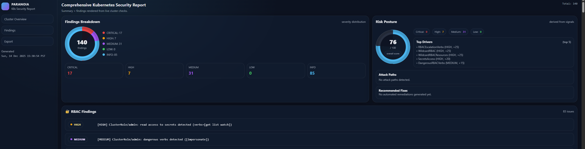

# Paranoia KSPM
Project Paranoia is a kubernetes security posture management tool in development by sn0rlaxlife


## Introduction ##
This project serves as a kubernetes security posture management tool written in Go, this uses the kubernetes native client to initiate controls such as validation across your cluster on the following best practices. Like many users that are new to ecosystem of microservices this serves as a human-prevention tool on deploying misconfigurations, areas of concern, elevated privileges.

## Updates as of June 2025 ##
This project is still in experimental phase and only to be used for development operations use at your own risk.

- Added functionality now exists to track pods, deployments, secrets, and clusters roles this is to target what you are concerned with rather all in one command
```bash
./paranoia watch -w --watch-pods
./paranoia watch -w --watch-deployments
./paranoia watch -w --watch-secrets
./paranoia watch -w --watch-clusterroles 
```

## Updates as of December 2025 ##
- Functionality to build reports
```bash
./paranoia report-html --kubeconfig <kube-config>
``` 
This centralizes the report in one visual for all checks in a one go round that allows you a risk-posture along with mapping a score report.

## Quick Start
To leverage this tool in your cluster run the following commands.
```bash
git clone https://github.com/sn0rlaxlife/paranoia.git && cd paranoia
```


<b> The Makefile checks if Trivy-operator is installed to run on CRD Checks </b>
Use of trivyoperator.sh (if this isn't installed run chmod +x trivyoperator.sh -> ./trivyoperator.sh
```bash
make build
```

Run a RBAC (Sanity check) by simply using the CLI syntax below
```bash
./paranoia rbac -b
```

Run a deployment check on labels in cluster to identify no labels on various deployments.
```bash
./paranoia deployment -c
```


Run checks to validate high valued roles are running and found in your cluster such as system:certificates.k8s.io, system:auth-delegator, system:aggregate-to-admin. This check will also run a scan on the Node to identify if HA is detected the default value for this is 3 nodes.
```bash
./paranoia check -c
```

Run a vulnerability report on a existing namespace this leverages the outbound to our trivy-operator and CRDs
```bash
./paranoia report --kubeconfig=<kube-config> -n <namespace>
```

## Additional Usage & Troubleshooting

### Prerequisites
- Go toolchain installed (for building the binary)
- `kubectl` access and a valid kubeconfig (or run in-cluster)
- Optional: Trivy Operator installed to enable CRD-based vulnerability reports

### Quick Commands
- Build the binary:
```bash
make build
```
- Watch resources (pods, deployments, secrets, clusterroles):
```bash
./paranoia watch -w --watch-pods
./paranoia watch -w --watch-deployments --watch-secrets --watch-clusterroles
```
- Run control-plane checks:
```bash
./paranoia check
```
- Run deployment label checks:
```bash
./paranoia deployment -d
```
- Run RBAC analysis:
```bash
./paranoia rbac -b
```
- Fetch Trivy-operator vulnerability reports (Requires trivy-operator):
```bash
./paranoia report --kubeconfig=/path/to/kubeconfig -n <namespace>
```
- Generate and serve the HTML report:
```bash
./paranoia report-html --kubeconfig=/path/to/kubeconfig
```

### HTML Report Image Preview



### Security & Permissions
The CLI needs permission to list/watch RBAC, Pods, Deployments, Secrets, and (optionally) read Trivy CRDs. For full visibility you will typically need elevated privileges (e.g., cluster-admin). Use caution when running in production clusters.
